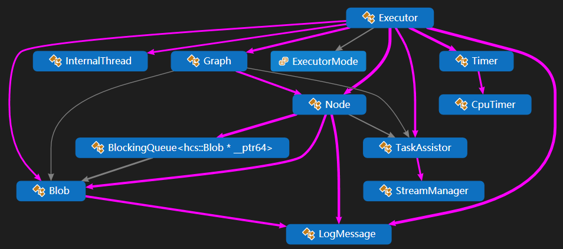

# hcs

Heterogeneous computing system.

---

## 主要功能

异构计算系统，主要用于多任务的调度优化，支持X86 CPU + Nvidia GPU的异构计算。

在应用中，一般存在多个具有一定依赖关系的任务需要被执行。该框架可根据这些任务的依赖关系自动构建计算图，以较优的方式对任务进行自动调度，实现调度逻辑的自动优化。

其中任务可以是纯CPU计算的，也可以是CPU与Nvidia GPU混合计算的，任务交互的细节由框架底层实现，用户只需要在外层构建自己的任务节点，并利用提供的接口函数组装计算图即可。

## 性能

测试环境：六核 I7-8750H + GTX1050，VS2017，CUDA10.

一、测试example/simple.cpp，含四个有依赖关系的CPU任务。

普通串行：耗时-平均 4300ms；CPU-7%.

调度优化：耗时-平均 1100ms；CPU-13%.

二、测试example/hetero_tasks/hetero_tasks.cpp，含三个GPU任务与四个CPU任务。

普通串行：耗时-平均 13500ms；CPU-15%；GPU-40%.

调度优化：耗时-平均 6600ms；CPU-30%；GPU-88%.

## 设计思路

将每个任务视为一个节点，以节点作为内部最小的计算单元，每个节点由一个线程进行绑定。

多个节点组成一个计算图，计算图则是面向用户的最小计算单元。

调用时，给计算图的输入节点填充数据，调用Run，后可在输出节点尝试获取结果。

计算图内部，数据以队列的方式存在，在调用执行函数后，各节点会计算输入数据并逐级往后传送，直至所有数据被处理完。执行函数Run是异步函数，调用Run后可以选择等待处理结束，也可以后续回来查看输出。

## 代码图


## 主要模块

1. Executor：调度器，最外层类，管控整个调度逻辑。
2. Graph：计算图，主要由Node组成，加入在Executor中由Executor同一管控。
3. Node：节点，最小的计算单元。每个节点的构建由用户进行，使用特定格式的函数指针接入功能函数。
4. Blob：数据存储单元，内存与显存交互与管理。
5. Profiler：异步调试器，可用于查看计算的状态等细节，方便发现问题。
6. TaskAssistor：任务辅助器，主要用于携带用户所需的信息与数据到任务节点中。

## 工具模块

1. BlockingQueue：堵塞队列，主要用于数据预取，同时减少内存碎片。
2. InternalThread：内部线程，在堵塞队列和异步调试器中有使用。
3. LogMessage：日志管理。
4. Timer：计时函数封装。

## 使用

直接链接头文件，即可使用。

```bash
#include "hcs/executor.hpp"
```

注：需要编译器支持C++17，需要链接cuda。